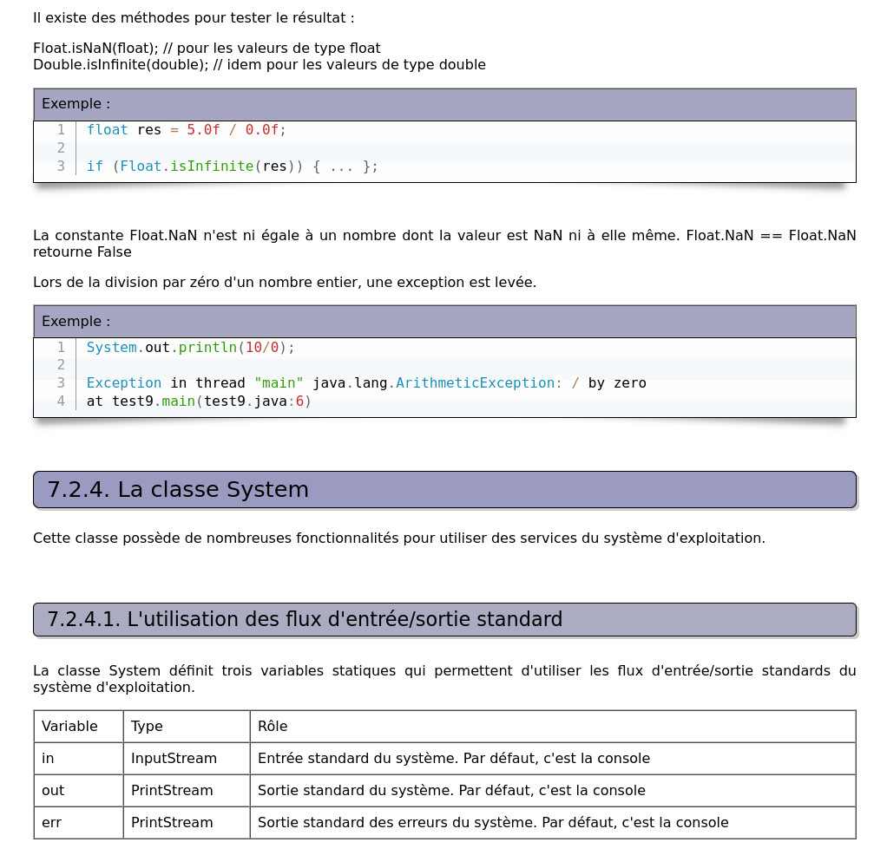
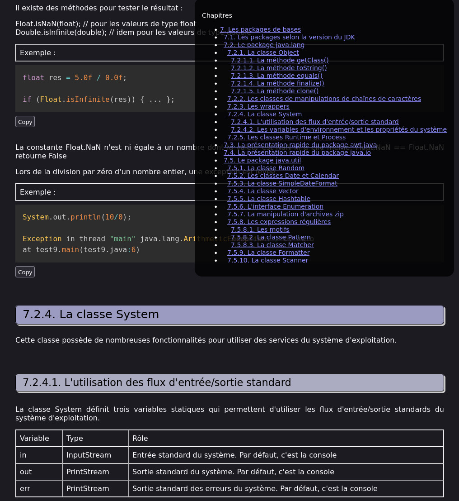

:fr: French repo about a french Website

Le site de J.M. Doudoux est une incroyable mine d'information, en particulier en ce qui concerne le langage Java.

Mais ce thème clair me brule les yeux à chaque fois que je le consulte.



C'est pourquoi, j'ai écrit un script à coller dans la console, qui active le thème sombre (à condition que votre navigateur soit en thème sombre), avec en bonus une table de matière pour simplifier la navigation entre les chapitres de la page.

### Le résultat



### Le script

#### :warning: Pour des raisons de sécurité, ne coller jamais un script dans la console de votre navigateur à moins de comprendre exactement ce qu'il fait :warning:

```js
// activation theme sombre
document.querySelector('link[href="prism.css"]').remove();
document.querySelectorAll('div[align="justify"] [bgcolor]').forEach(el => el.removeAttribute('bgcolor'));

const style = document.createElement("style");
style.innerHTML = `
:root {
    color-scheme:light dark;
}
body {
    background-color:unset;
    color:unset;
}
@media (prefers-color-scheme:light) {
    :root{
        --bg-primary:rgb(255 255 255 / .8);
        --text-primary:black;
    }

    /* Feuille de styles claire pour la coloration syntaxique */
    code[class*=language-],pre[class*=language-]{color:#000;background:0 0;font-family:Consolas,Monaco,'Andale Mono','Ubuntu Mono',monospace;font-size:1em;text-align:left;white-space:pre;word-spacing:normal;word-break:normal;word-wrap:normal;line-height:1.5;-moz-tab-size:4;-o-tab-size:4;tab-size:4;-webkit-hyphens:none;-moz-hyphens:none;-ms-hyphens:none;hyphens:none}pre[class*=language-]{position:relative;margin:.5em 0;overflow:visible;padding:1px}pre[class*=language-]>code{position:relative;z-index:1;border-left:10px solid #358ccb;box-shadow:-1px 0 0 0 #358ccb,0 0 0 1px #dfdfdf;background-color:#fdfdfd;background-image:linear-gradient(transparent 50%,rgba(69,142,209,.04) 50%);background-size:3em 3em;background-origin:content-box;background-attachment:local}code[class*=language-]{max-height:inherit;height:inherit;padding:0 1em;display:block;overflow:auto}:not(pre)>code[class*=language-],pre[class*=language-]{background-color:#fdfdfd;-webkit-box-sizing:border-box;-moz-box-sizing:border-box;box-sizing:border-box;margin-bottom:1em}:not(pre)>code[class*=language-]{position:relative;padding:.2em;border-radius:.3em;color:#c92c2c;border:1px solid rgba(0,0,0,.1);display:inline;white-space:normal}pre[class*=language-]:after,pre[class*=language-]:before{content:'';display:block;position:absolute;bottom:.75em;left:.18em;width:40%;height:20%;max-height:13em;box-shadow:0 13px 8px #979797;-webkit-transform:rotate(-2deg);-moz-transform:rotate(-2deg);-ms-transform:rotate(-2deg);-o-transform:rotate(-2deg);transform:rotate(-2deg)}pre[class*=language-]:after{right:.75em;left:auto;-webkit-transform:rotate(2deg);-moz-transform:rotate(2deg);-ms-transform:rotate(2deg);-o-transform:rotate(2deg);transform:rotate(2deg)}.token.block-comment,.token.cdata,.token.comment,.token.doctype,.token.prolog{color:#7d8b99}.token.punctuation{color:#5f6364}.token.boolean,.token.constant,.token.deleted,.token.function-name,.token.number,.token.property,.token.symbol,.token.tag{color:#c92c2c}.token.attr-name,.token.builtin,.token.char,.token.function,.token.inserted,.token.selector,.token.string{color:#2f9c0a}.token.entity,.token.operator,.token.url,.token.variable{color:#a67f59;background:rgba(255,255,255,.5)}.token.atrule,.token.attr-value,.token.class-name,.token.keyword{color:#1990b8}.token.important,.token.regex{color:#e90}.language-css .token.string,.style .token.string{color:#a67f59;background:rgba(255,255,255,.5)}.token.important{font-weight:400}.token.bold{font-weight:700}.token.italic{font-style:italic}.token.entity{cursor:help}.token.namespace{opacity:.7}@media screen and (max-width:767px){pre[class*=language-]:after,pre[class*=language-]:before{bottom:14px;box-shadow:none}}pre[class*=language-].line-numbers.line-numbers{padding-left:0}pre[class*=language-].line-numbers.line-numbers code{padding-left:3.8em}pre[class*=language-].line-numbers.line-numbers .line-numbers-rows{left:0}pre[class*=language-][data-line]{padding-top:0;padding-bottom:0;padding-left:0}pre[data-line] code{position:relative;padding-left:4em}pre .line-highlight{margin-top:0}
}
@media (prefers-color-scheme:dark){
    :root{
        --bg-primary:rgb(0 0 0 / .8);
        --text-primary:white;
    }

    /* Feuille de styles sombre pour la coloration syntaxique */
    code[class*=language-],pre[class*=language-]{color:#ccc;background:0 0;font-family:Consolas,Monaco,'Andale Mono','Ubuntu Mono',monospace;font-size:1em;text-align:left;white-space:pre;word-spacing:normal;word-break:normal;word-wrap:normal;line-height:1.5;-moz-tab-size:4;-o-tab-size:4;tab-size:4;-webkit-hyphens:none;-moz-hyphens:none;-ms-hyphens:none;hyphens:none}pre[class*=language-]{padding:1em;margin:.5em 0;overflow:auto}:not(pre)>code[class*=language-],pre[class*=language-]{background:#2d2d2d}:not(pre)>code[class*=language-]{padding:.1em;border-radius:.3em;white-space:normal}.token.block-comment,.token.cdata,.token.comment,.token.doctype,.token.prolog{color:#999}.token.punctuation{color:#ccc}.token.attr-name,.token.deleted,.token.namespace,.token.tag{color:#e2777a}.token.function-name{color:#6196cc}.token.boolean,.token.function,.token.number{color:#f08d49}.token.class-name,.token.constant,.token.property,.token.symbol{color:#f8c555}.token.atrule,.token.builtin,.token.important,.token.keyword,.token.selector{color:#cc99cd}.token.attr-value,.token.char,.token.regex,.token.string,.token.variable{color:#7ec699}.token.entity,.token.operator,.token.url{color:#67cdcc}.token.bold,.token.important{font-weight:700}.token.italic{font-style:italic}.token.entity{cursor:help}.token.inserted{color:green}
}
`;
document.querySelector("body").append(style);

// ajout d'un sommaire
let chapterList = document.querySelectorAll("h1 a, h2 a, h3 a, h4 a, h5 a");

const tocContainer = document.createElement("div");
tocContainer.classList.add('toc-container');

const tocTitle = document.createElement("p");
tocTitle.innerHTML = "Chapitres";
tocContainer.append(tocTitle);

const tocList = document.createElement("ul");
tocList.classList.add('toc-list');
for (const entry of chapterList) {
    const entryChapterLevel = entry.textContent.split(" ")[0].split(".").length - 1;
    const link = document.createElement("a");
    link.href = `#${entry.getAttribute("name")}`;
    link.textContent = entry.textContent;
    const li = document.createElement("li");
    li.style = `padding-left: ${(entryChapterLevel - 1) / 2}rem`;
    li.append(link);
    tocList.append(li);
}
tocContainer.append(tocList);

const tocStyle = document.createElement("style");
tocStyle.innerHTML = `
    .toc-container {
        position: fixed;
        top: 1rem;
        right: 1rem;
        padding: 1rem;
        border-radius: 1rem;
        background-color: var(--bg-primary);
        font-size: 0.875rem;
    }
    .toc-container .toc-list {
        max-height: 0;
        overflow-y: auto;
        transition: max-height 0.1s ease-out;
    }
    .toc-container:hover .toc-list {
        max-height: 40vh;
    }
`;
tocContainer.append(tocStyle);

document.querySelector("body").append(tocContainer);
```
